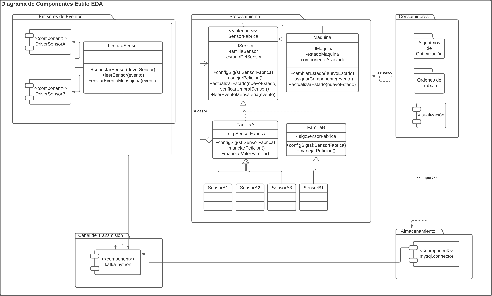

# Iteración 2

## Formatos MADR

[MADR 2.1.1](MADR_2_1_1.md)

[MADR 2.1.2](MADR_2_1_2.md)

[MADR 2.1.3](MADR_2_1_3.md)

[MADR 2.1.4](MADR_2_1_4.md)

[MADR 2.2.1](MADR_2_2_1.md)

[MADR 2.2.2](MADR_2_2_2.md)

[MADR 2.2.3](MADR_2_2_3.md)

[MADR 2.3.1](MADR_2_3_1.md)

[MADR 2.3.2](MADR_2_3_2.md)

## Diagrama UML

